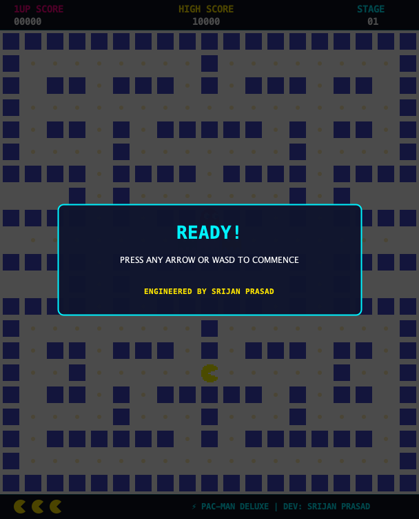
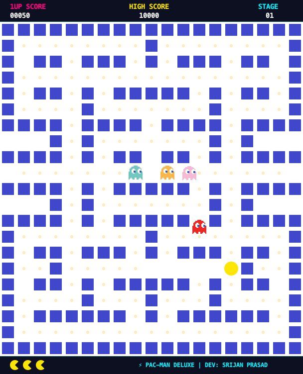
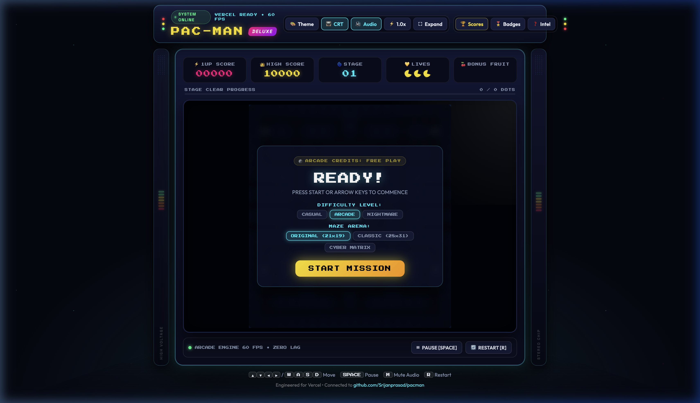
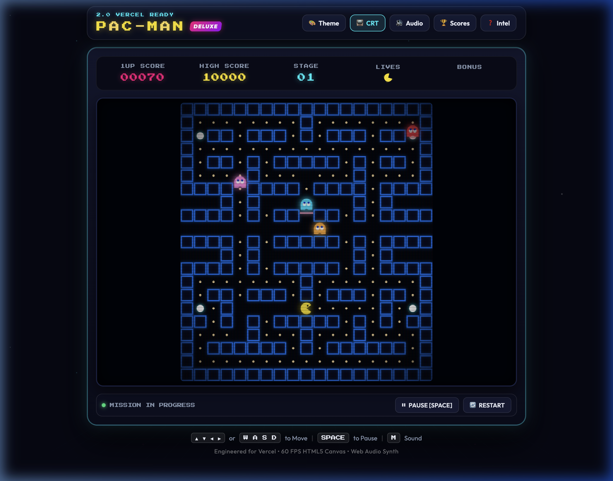
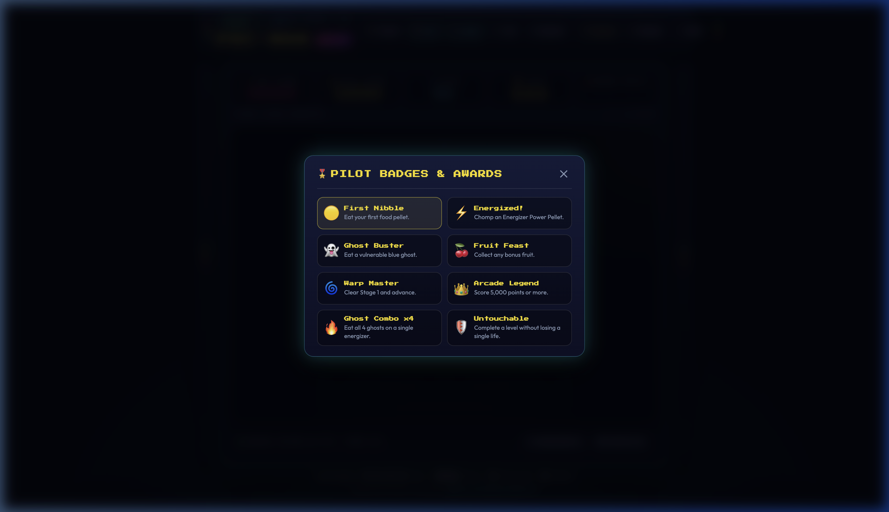
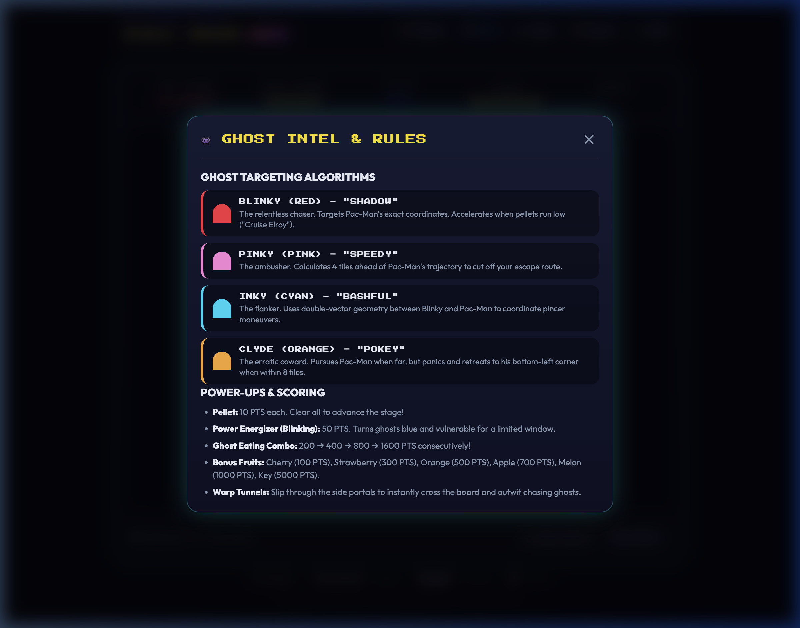

# 🕹️ PAC-MAN DELUXE ARCADE (Java Edition)

<div align="center">


<br/>
</div>

---

## 📖 Overview

**PAC-MAN DELUXE ARCADE** is a commercial-grade, high-performance remake of the legendary 1980 Namco arcade classic, engineered in **pure Java** using modern **Java 2D Swing** graphics.

Unlike basic tutorial clones where ghosts move purely at random and Pac-Man gets stuck against wall corners, this edition features:
- **Corridor Grid Alignment & Corner Buffering**: Fluid corner turns without sticking or freezing.
- **Power Energizers & Scared Ghost Combos**: Pulsating power pellets turn ghosts vulnerable with a flashing countdown timer and escalating `200 → 400 → 800 → 1600` combo multipliers.
- **Authentic Ghost AI Personalities**: Blinky (Chaser), Pinky (Ambusher), Inky (Flanker), and Clyde (Coward).
- **Procedural 8-Bit Java Sound Engine**: 100% pure procedural tone synthesis using standard `javax.sound.sampled` — zero external MP3/WAV dependencies!
- **Warp Tunnels**: Smooth wrap-around teleportation between left and right gates.
- **Developer Credits**: Prominently features credits for **Srijan Prasad**.

---

## 📸 Screenshots & Visual Showcase

### 1. Java Edition — System Ready & Mission Launch
> *The modern Java Swing interface featuring anti-aliased HUD, developer watermark, and ready modal.*

<div align="center">
  
</div>

<br/>

### 2. Java Edition — Active 60 FPS Mission Gameplay
> *Pac-Man navigating corridors, consuming dots, and evading Blinky in high-speed tile-locked action.*

<div align="center">
  
</div>

<br/>

### 3. Cyber Retro Web Edition — Deluxe Arcade Cabinet (Bonus)
> *The expanded web version with neon marquee, dynamic audio VU meters, and telemetry glass HUD.*

<div align="center">
  
</div>

<br/>

### 4. Frightened Ghost Blue Mode & Energizer Consumption
> *Pulsating power pellet eaten; ghosts turn vulnerable blue and flash before reverting.*

<div align="center">
  
</div>

<br/>

### 5. Pilot Badges & Achievement System
> *8 unlockable milestones and achievement awards.*

<div align="center">
  
</div>

<br/>

### 6. Ghost AI Intel & Strategy Guide
> *Detailed radar profiles and targeting behaviors for Blinky, Pinky, Inky, and Clyde.*

<div align="center">
  
</div>

---

## 🎮 Game Controls

| Key Binding | Action | Description |
| :--- | :--- | :--- |
| **`▲` / `W`** | Move Up | Steer Pac-Man upward (with pre-turn corner buffering) |
| **`▼` / `S`** | Move Down | Steer Pac-Man downward |
| **`◀` / `A`** | Move Left | Steer Pac-Man to the left |
| **`▶` / `D`** | Move Right | Steer Pac-Man to the right |
| **`Space`** | Pause / Resume | Toggle system pause during mission |
| **`M`** | Toggle Audio | Mute / Unmute procedural sound engine |
| **`R`** | Restart | Reset game and start a new mission |

---

## 🚀 How to Run the Java Game

### Prerequisites
You need **Java Development Kit (JDK 17 or higher)** installed on your machine.
Verify your installation:
```bash
java -version
javac -version
```

### Option A: Launch Standalone Executable JAR (One-Click)
A pre-compiled, self-contained runnable JAR is included in `pacman-java/`:
```bash
# Run directly from terminal
java -jar pacman-java/PacManDeluxe.jar
```

### Option B: Compile & Run from Source Code
```bash
# 1. Navigate to the java source directory
cd pacman-java

# 2. Compile all Java source files
javac App.java PacMan.java SoundEngine.java

# 3. Launch the game
java App
```

---

## 🧠 Authentic Ghost AI Personalities

Each ghost operates with its own distinct targeting mathematics:

1. **🔴 Blinky (Red Ghost — "Shadow")**:
   - **Role:** Aggressive Chaser
   - **Behavior:** Directly targets Pac-Man's current grid position at all times.
2. **🌸 Pinky (Pink Ghost — "Speedy")**:
   - **Role:** Tactical Ambusher
   - **Behavior:** Targets 4 tiles ahead of Pac-Man's movement vector to cut off escape routes.
3. **🔷 Inky (Cyan Ghost — "Bashful")**:
   - **Role:** Pincer Flanker
   - **Behavior:** Calculates a dual vector from Blinky to Pac-Man, trapping Pac-Man between two ghosts.
4. **🟠 Clyde (Orange Ghost — "Pokey")**:
   - **Role:** Coward / Wanderer
   - **Behavior:** Pursues Pac-Man when far (> 6 tiles away), but panics and flees to the bottom-left corner when approaching within 6 tiles.

---

## ⚡ Technical Highlights

### 1. Zero-Lag Corner Buffer System
- Rather than checking raw pixel bounding boxes that catch on 1-pixel corners, `PacMan.java` uses a **directional intent buffer** (`nextDirection`).
- When you press a turn key before reaching an intersection, the engine buffers your input and executes the turn with pixel-precision the moment Pac-Man hits the tile crossway.

### 2. Procedural 8-Bit Java Sound Engine
- `SoundEngine.java` uses Java's native `javax.sound.sampled.AudioSystem` to synthesize square-wave retro tones dynamically in memory:
  - *Chomp Tone:* Alternating dual-frequency 330Hz / 480Hz pulses.
  - *Energizer Chime:* Ascending pitch buzz.
  - *Ghost Crunch:* Quad-tone victory arpeggio.
  - *Fruit Chime:* Pleasant major triad.
  - *Death Sound:* Chromatic falling-pitch bend.
- Uses a background daemon thread pool (`ExecutorService`) so audio synthesis never interrupts the 60 FPS graphics loop.

### 3. Developer Branding
- Window title bar: `PAC-MAN DELUXE ARCADE • Developed by Srijan Prasad`.
- Real-time on-screen HUD branding: `⚡ PAC-MAN DELUXE | DEV: SRIJAN PRASAD`.
- Overlay dialogs certified with `ENGINEERED BY SRIJAN PRASAD`.

---

## 🌐 Web Edition (Bonus Vercel Deployment)

In addition to the standalone desktop Java application, a synchronized **Web Edition (Vite + HTML5 Canvas)** is included in the root directory for browser play and instant cloud deployment:

```bash
# Run local web server
npm install
npm run dev
```

Deploy to **Vercel** with zero configuration:
```bash
npx vercel --prod
```

---

## 👨‍💻 Author & Credits

- **Creator & Developer:** **Srijan Prasad**
- **GitHub:** [@Srijanprasad](https://github.com/Srijanprasad)
- **Repository:** [https://github.com/Srijanprasad/pacman](https://github.com/Srijanprasad/pacman)
- **Copyright:** © 2026 Srijan Prasad. All Rights Reserved.
